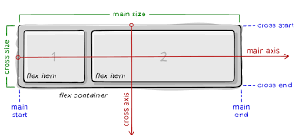

# Indrodução ao Flex Box

O flex Box foi projeto como um modelo de layout unidimensional e como método que pode oferecer distribuição de espaço entre itens em uma interface e recursos de alinhamento. 
* tabela das versões e navegadores que suportam o flex box

|  |   |  |  |  
|---|---|---|---|---|---|---|
| 29.0 | 11.0 | 22.0| 10 | 48 | 

## Flex Container 

É a tag que envolve os itens, será nela que iremos aplicar a propriedade ``display: flex``. Transforma todos os seus itens filhos em flex itens. 

* Pode ser aplicada em qualquer tag html como por exemplo ``<h1>``, ``
`` ,``<a>``...

### Propriedades relacionadas
* display           
* flex-direction     
* flex-wrap         
* flex-flow
* justify-content
* align-items
* align-content

#### Display: flex;
Torna a tag um elemento do tipo flex container e assim automaticamente todos os seus filhos diretos desta tag, tornam-se em flex items.
